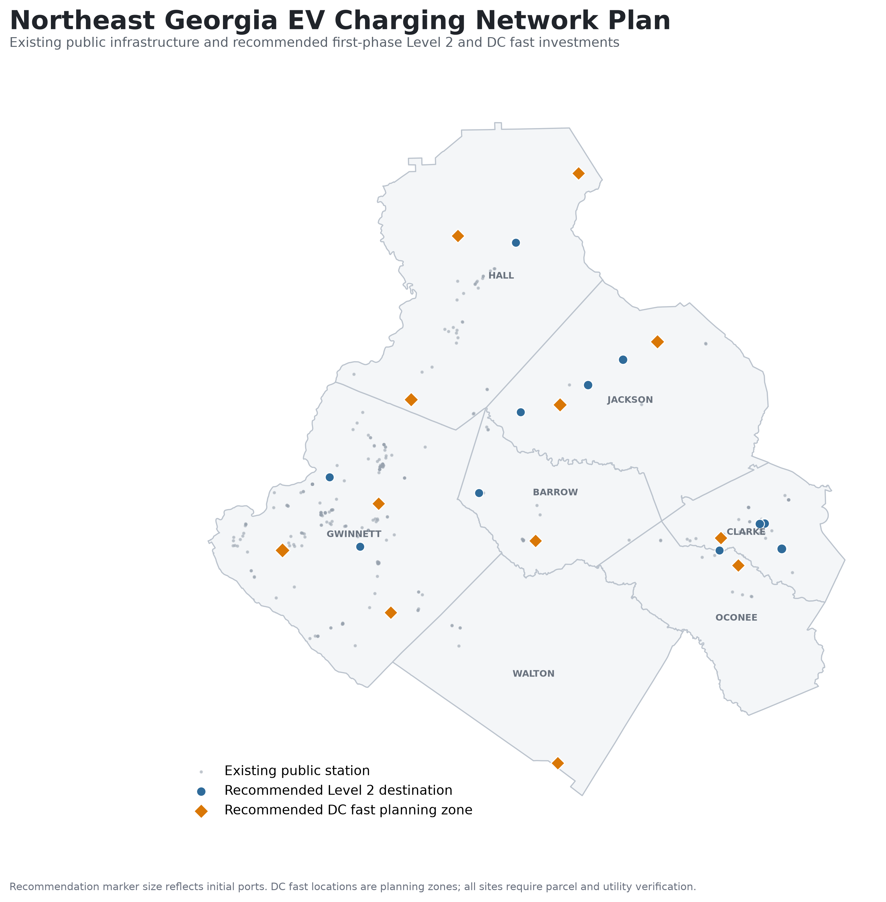
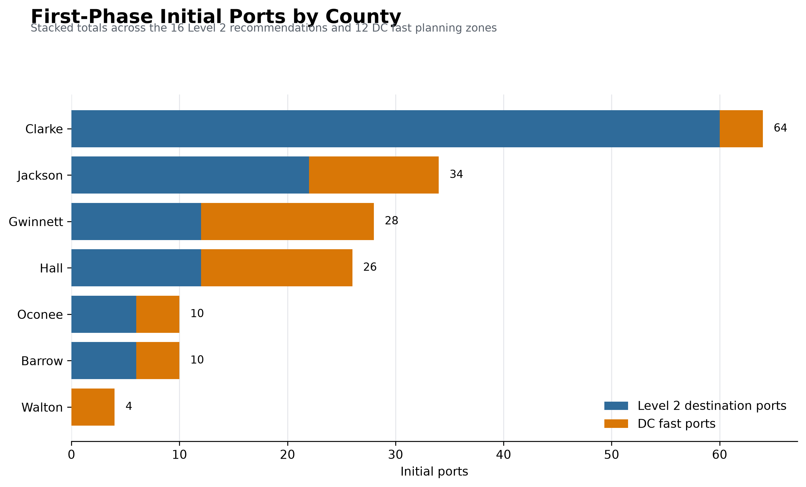
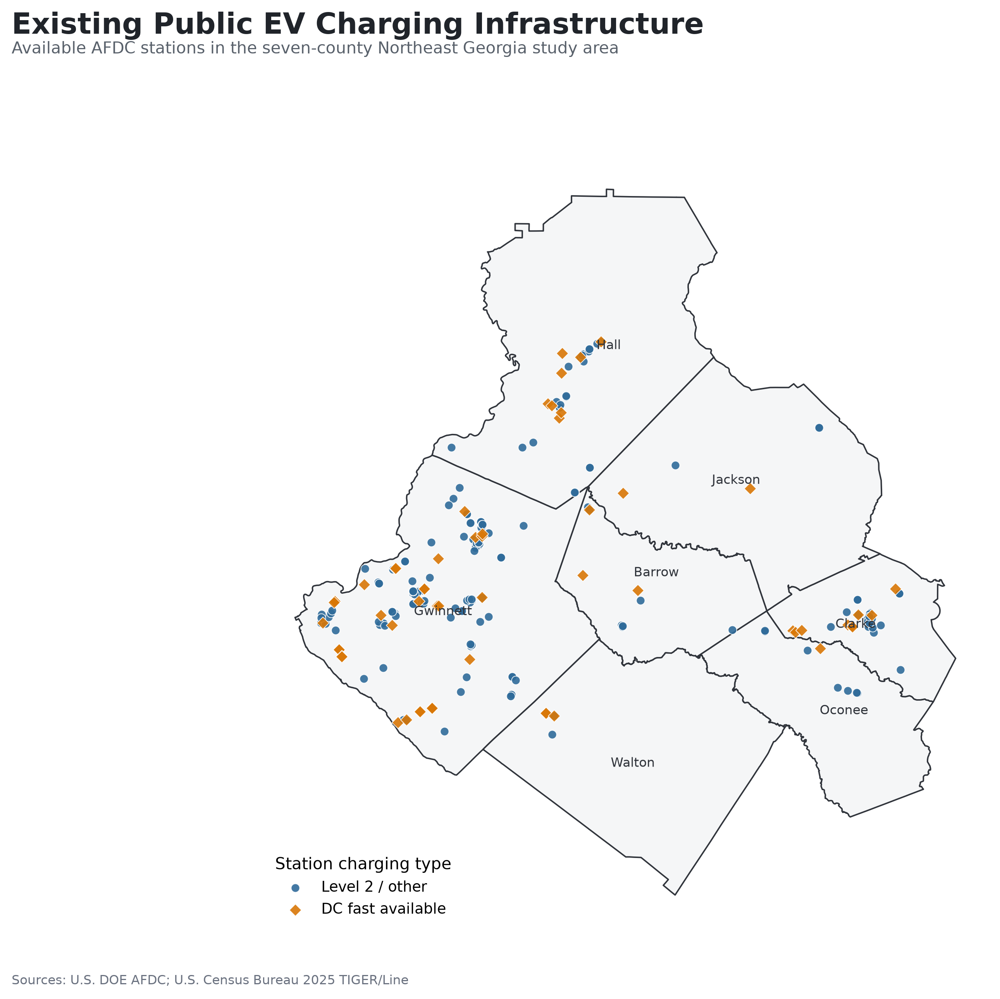
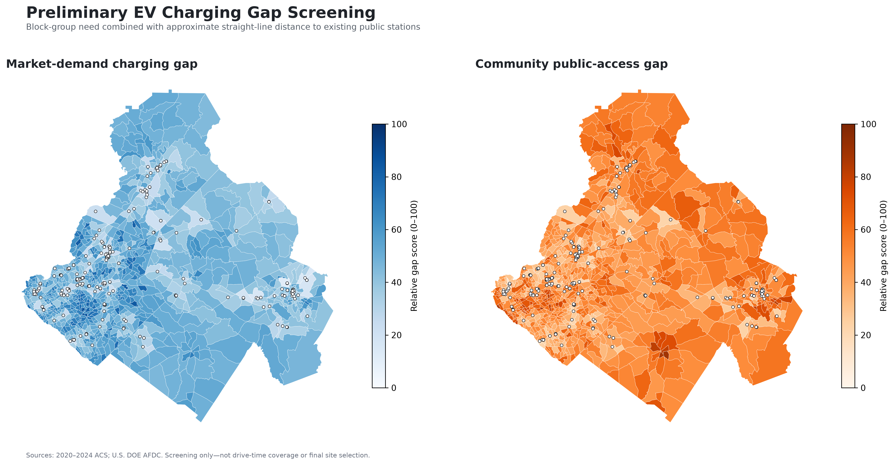
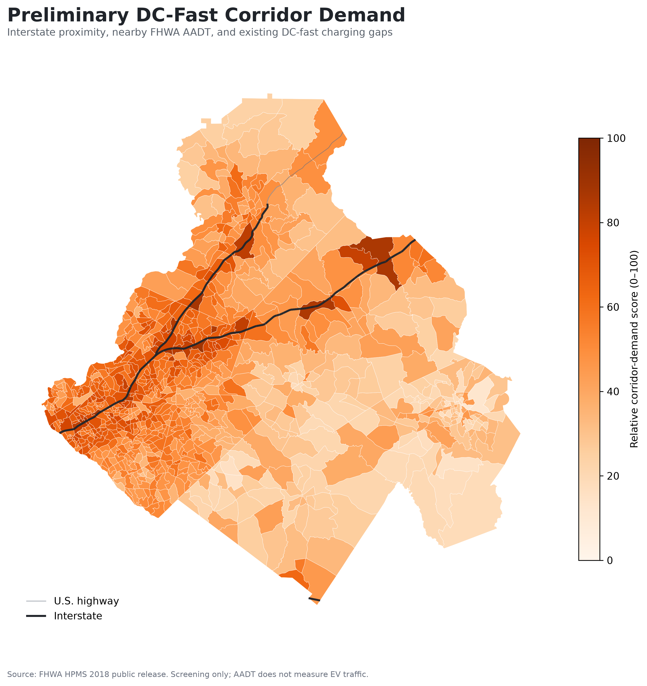
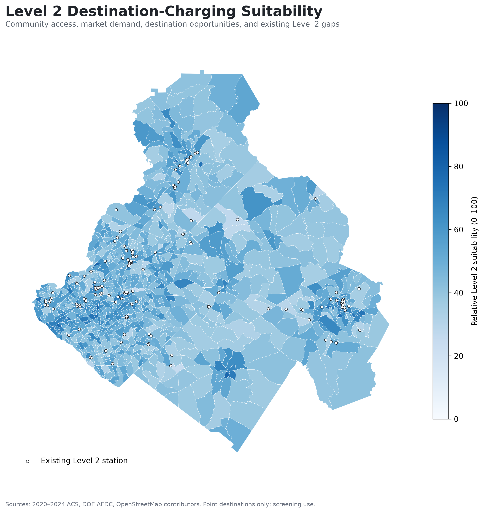
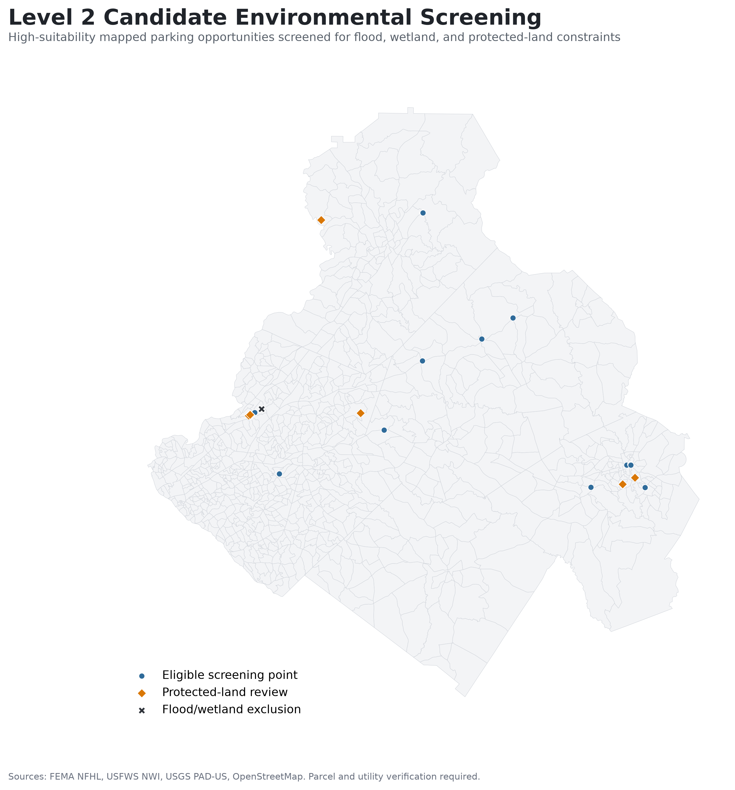

# Planning Northeast Georgia's Next EV Charging Network

## Project summary

Where should Northeast Georgia install additional public EV charging, which charging technology should each location use, and how many ports should be included?

This project evaluates public charging infrastructure across **Barrow, Clarke, Gwinnett, Hall, Jackson, Oconee, and Walton counties**. It combines charging-station inventories, Census demand indicators, highway traffic, destination opportunities, environmental constraints, and EV-adoption scenarios to recommend a practical first deployment phase.

The completed analysis recommends:

- **16 Level 2 destination-charging locations**
- **12 DC fast-charging planning zones**
- **176 initial charging ports**
- **Expansion capacity to 298 ports**
- Level 2 connectors supporting **J1772 and J3400/NACS**
- DC fast connectors supporting **CCS1 and J3400/NACS**

These are planning recommendations. Exact parcels and construction designs require ownership, zoning, utility-capacity, engineering, accessibility, and field verification.



## Why this project matters

Public EV charging is not one uniform planning problem. Drivers need different infrastructure depending on where and why they charge:

- **Level 2 destination charging** supports workplaces, public facilities, retail areas, recreation, apartments, and other locations with longer dwell times.
- **DC fast charging** supports highway travel, high-volume transportation corridors, and drivers who cannot rely on overnight residential charging.
- **Community-access planning** helps prevent investment from flowing only to affluent areas with strong near-term market demand.

The project models these needs separately and combines them only when producing the final network recommendations.

## Key findings

### Existing charging supply

The seven-county study area contains:

- **272 unique public charging stations**
- **580 Level 2 ports**
- **282 DC fast ports**

Infrastructure is concentrated in Gwinnett County and the larger urban centers. Several outer counties have fewer public charging options and longer access gaps.

### Moderate EV-adoption scenario

The primary planning scenario assumes EV adoption among **12% of vehicle-owning households**:

| Measure | Modeled result |
|---|---:|
| Projected EV-owning households | 181,260 |
| Required public Level 2 ports | 6,172 |
| Existing Level 2 ports | 580 |
| Additional Level 2 planning need | 5,592 |
| Required DC fast ports | 1,053 |
| Existing DC fast ports | 282 |
| Additional DC fast planning need | 771 |

The port-demand totals are long-range regional planning estimates. The first-phase recommendations intentionally represent a smaller, implementable starting point rather than the entire modeled deficit.

### First-phase deployment

| Charging role | Locations or zones | Initial ports | Expansion capacity |
|---|---:|---:|---:|
| Level 2 destination charging | 16 | 118 | 182 |
| DC fast charging | 12 | 58 | 116 |
| **Total** | **28** | **176** | **298** |



## Charging recommendations

| Charging role | Recommended power | Connector strategy | Typical use |
|---|---|---|---|
| Level 2 destination | 11.5–19.2 kW AC | J1772 and J3400/NACS | Retail, civic, recreation, workplace, and community destinations |
| Standard DC fast | 150–250 kW | CCS1 and J3400/NACS | Regional corridors and moderate-demand highway locations |
| High-power DC fast | 250–350 kW | CCS1 and J3400/NACS | High-traffic corridors and major travel demand |

CHAdeMO remains in the existing-station inventory as a legacy connector but is not a default recommendation for new first-phase installations.

## Analytical workflow

| Notebook | Purpose |
|---|---|
| `01_project_setup.ipynb` | Create and verify the local project structure |
| `02_download_afdc_charging_data.ipynb` | Download and inspect the AFDC charging inventory |
| `03_build_study_area_and_station_inventory.ipynb` | Build the study area and existing-infrastructure inventory |
| `04_download_acs_charging_demand_data.ipynb` | Acquire ACS demographic, housing, and transportation indicators |
| `05_charging_gap_and_underserved_communities.ipynb` | Model market, community-access, and DC fast-charging gaps |
| `06_gdot_corridor_and_traffic_demand.ipynb` | Combine highway proximity with official FHWA traffic volume |
| `07_level2_destination_suitability.ipynb` | Score mapped Level 2 destination opportunities |
| `08_candidate_site_environmental_screening.ipynb` | Screen candidates for flood, wetland, and protected-land constraints |
| `09_charging_port_demand_scenarios.ipynb` | Estimate port requirements under three EV-adoption scenarios |
| `10_ranked_station_recommendations.ipynb` | Rank first-phase locations and assign equipment and port counts |
| `11_final_portfolio_outputs.ipynb` | Produce the final maps, scorecard, and portfolio tables |

Earlier superseded Notebook 09 and Notebook 10 drafts are preserved in `notebooks/archive/`.

## Methods demonstrated

- Reproducible Python and Jupyter analysis
- GeoPandas spatial joins and nearest-feature analysis
- Census Summary File acquisition and cleaning
- Population, household, renter, and multifamily indicators
- Market-demand and public-access indices
- Charging-station deduplication and port inventory
- Interstate proximity and AADT corridor modeling
- OpenStreetMap destination extraction
- Multi-criteria suitability scoring
- FEMA flood-hazard screening
- USFWS wetland screening
- USGS protected-land review flags
- Scenario modeling and sensitivity checks
- Connector and charging-power recommendations
- Cartographic design and automated QA

## Selected outputs

### Existing charging infrastructure



### Community charging gaps



### DC fast corridor demand



### Level 2 destination suitability



### Environmental screening



## Data sources

- [DOE Alternative Fuels Data Center](https://afdc.energy.gov/data_download) — existing stations, ports, charging levels, and connectors
- [U.S. Census Bureau, 2020–2024 ACS 5-year estimates](https://www.census.gov/programs-surveys/acs) — population, households, income, renters, multifamily housing, and vehicle access
- [Census TIGER/Line](https://www.census.gov/geographies/mapping-files/time-series/geo/tiger-line-file.html) — block-group and county boundaries
- [FHWA Highway Performance Monitoring System](https://www.fhwa.dot.gov/policyinformation/hpms.cfm) — roadway and traffic-volume indicators
- [OpenStreetMap and Geofabrik](https://download.geofabrik.de/north-america/us/georgia.html) — destination and parking opportunities
- [FEMA National Flood Hazard Layer](https://www.fema.gov/flood-maps/national-flood-hazard-layer) — flood screening
- [USFWS National Wetlands Inventory](https://www.fws.gov/program/national-wetlands-inventory) — wetland screening
- [USGS PAD-US](https://www.usgs.gov/programs/gap-analysis-project/science/pad-us-data-overview) — protected-land review
- [NREL 2030 National Charging Network](https://www.nrel.gov/docs/fy23osti/85654.pdf) — public charging benchmark ratios

## Reproducing the analysis

Create the Conda environment:

```powershell
conda env create -f environment.yml
conda activate ev-charging-gis
```

Run the notebooks in numeric order:

```powershell
jupyter lab
```

The notebooks save intermediate spatial layers and tables so later stages can be rerun without repeating every download. Each analytical stage includes input checks, grain and join validation, calculation checks, and expected-output assertions.

Downloaded source files and generated analytical outputs are excluded from Git by default. Final portfolio maps are retained in `maps/`.

## Repository structure

```text
Project 4 - EV Charging Suitability/
├── data/
│   ├── raw/                 # Downloaded source data
│   └── processed/           # Reusable processed data
├── maps/                    # Portfolio-ready map exports
├── notebooks/               # Primary notebooks in execution order
│   └── archive/             # Preserved superseded drafts
├── outputs/
│   ├── figures/             # Analytical charts
│   ├── spatial/             # GeoPackage outputs
│   └── tables/              # CSV recommendations and summaries
├── environment.yml
├── requirements.txt
└── README.md
```

## Limitations

- Port requirements use transparent scenario assumptions and national NREL benchmark ratios rather than a full regional EVI-Pro/EVI-X simulation.
- Vehicle-owning households are a proxy for the potential EV-owning population, not observed vehicle registrations or an official EV forecast.
- Straight-line proximity and block-group planning zones do not replace a drive-time network or charger-queue simulation.
- OpenStreetMap feature completeness varies, and the Level 2 opportunity model uses mapped point destinations.
- AADT represents total roadway traffic rather than EV-specific traffic.
- ACS estimates contain sampling uncertainty.
- Candidate points are not verified parcels.
- Environmental screening does not replace regulatory review.
- Existing utility lines do not prove that adequate electrical capacity is available.
- Final implementation requires property-owner engagement, zoning and permitting review, ADA design, safe access, lighting, networking, payment, reliability, and utility coordination.

## Portfolio takeaway

This project demonstrates an end-to-end GIS planning workflow: acquiring public data, engineering demographic indicators, measuring infrastructure gaps, modeling destination and corridor suitability, screening environmental constraints, estimating demand under uncertainty, and translating the results into defensible infrastructure recommendations.
